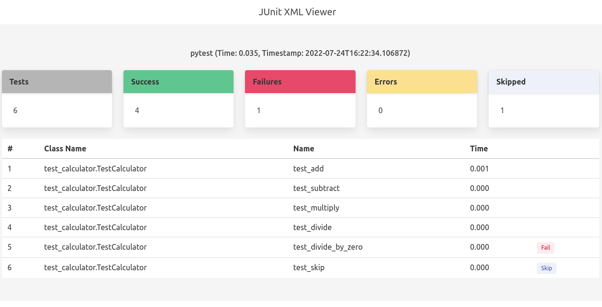

# JUnit XML Viewer

A tiny cli application that can read a JUnit XML file and makes it readable.

## Usage

```text
Options:
  -f Path to the JUnit XML file.
  -e To render the dashboard to stdout.
  -p Port to serve the dashboard on.
```

By default, the JUnit XML file is rendered to an HTML document and served on the default port 8080. 

```sh
jxv -f test.xml

Serving the dashboard at http://localhost:8080/
Press CTRL+C to stop the server.
```

You can write the HTML document to stdout by passing the -e flag.

```sh
jvx -f test.xml -e
```

## Example

```python
# test_calculator.py
import pytest


class TestCalculator:

    def test_add(self):
        assert 4 == 2 + 2

    def test_subtract(self):
        assert 2 == 4 - 2

    def test_multiply(self):
        assert 100 == 10 * 10

    def test_divide(self):
        assert 10 == 100 / 10
    
    # This test will fail.
    def test_divide_by_zero(self):
        assert 0 == 100 / 0

    @pytest.mark.skip(reason="for testing")
    def test_skip(self):
        assert True
```

```sh
python3 -m pytest test_calculator.py --junitxml=test.xml
jvx -f test.xml

Serving the dashboard at http://localhost:8080/
Press CTRL+C to stop the server.
```

